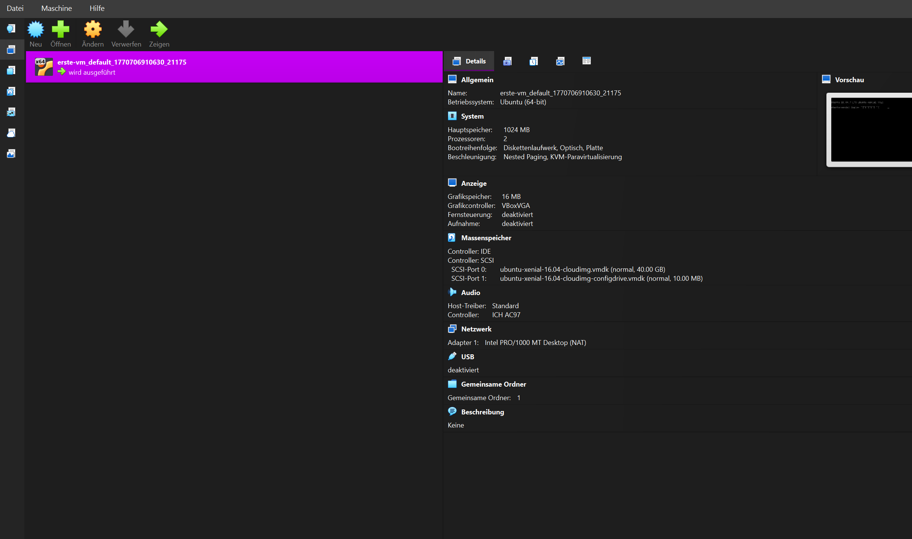
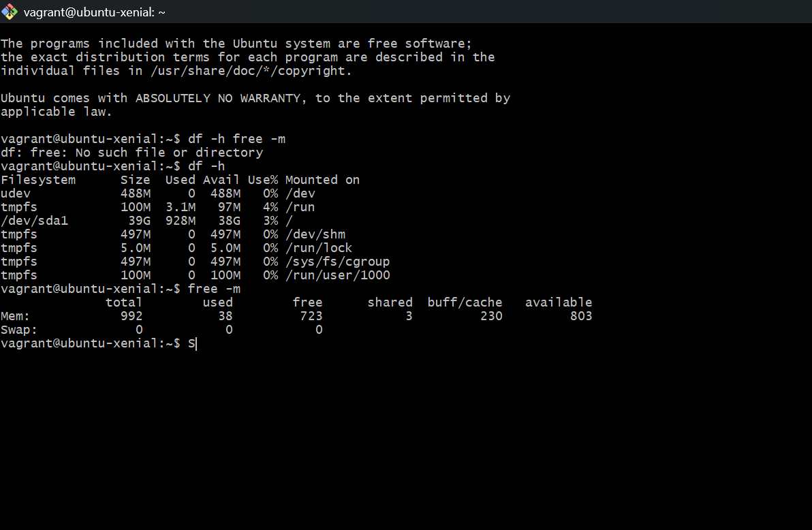
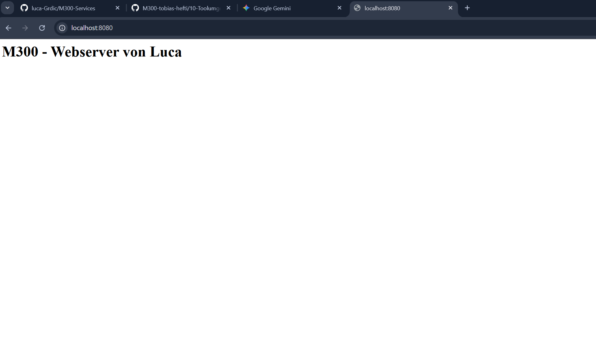

Durchführung
Zuerst wurde lokal der Ordner m300-arbeit/erste-vm erstellt. Über das Terminal wurden folgende Befehle ausgeführt:

vagrant init ubuntu/xenial64: Download der Konfigurationsvorlage.

vagrant up: Automatisches Erstellen und Starten der VM in VirtualBox.

vagrant ssh: Aufbau einer sicheren Verbindung zur Kommandozeile der VM.

Kontrolle in VirtualBox
In der VirtualBox-Oberfläche ist ersichtlich, dass die Maschine korrekt registriert wurde und läuft.

Systemprüfung (Verifizierung)
Nach dem Login via SSH wurden die Systemressourcen geprüft, um sicherzustellen, dass die VM korrekt partitioniert und mit Arbeitsspeicher versorgt wurde.

Ausgeführte Befehle:

df -h (Festplattenbelegung)

free -m (Arbeitsspeicher)

Konfiguration (Vagrantfile)
Ich habe das Vagrantfile mit folgendem Shell-Skript für die Automatisierung ergänzt:

Verifizierung (Erfolgskontrolle)
Nachdem die VM korrekt gestartet wurde, ist der Webserver unter http://localhost:8080 auf dem Laptop erreichbar.

