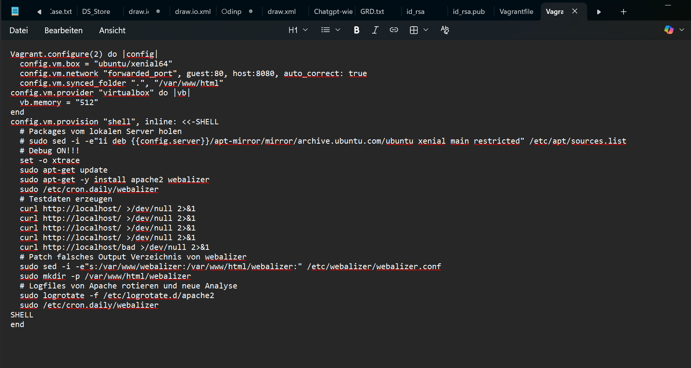
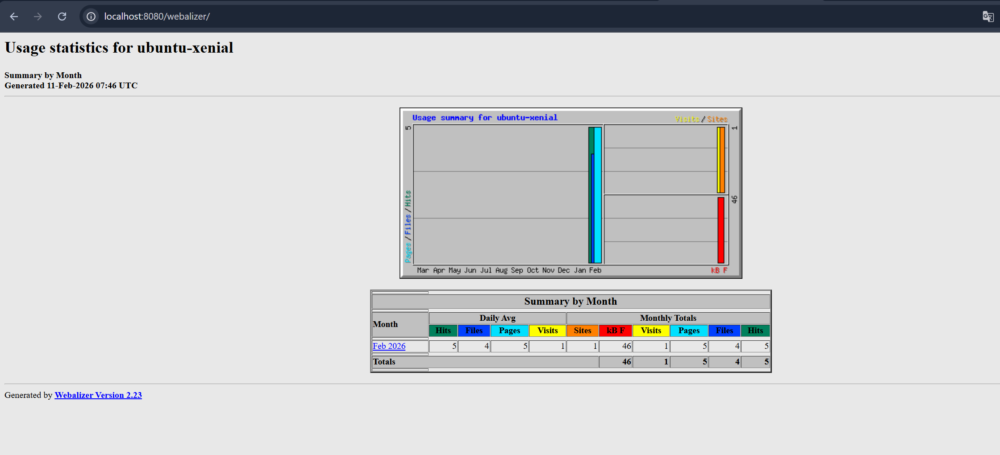

# Dokumentation LB2 Hands-on: Automatisierung der Log-Analyse mit Webalizer

Im Rahmen dieses Auftrags habe ich die Installation und Konfiguration eines Log-Analyse-Tools automatisiert. Ziel war es, dass nach dem Start der virtuellen Maschine (VM) sofort ein funktionsfähiger Webserver inklusive grafischer Auswertung der Zugriffsstatistiken bereitsteht.

## Mein Vorgehen und die manuelle Testphase

Um die Automatisierung vorzubereiten, habe ich zuerst manuell eine Testumgebung aufgebaut. Dazu erstellte ich lokal das Verzeichnis `myVM` und initialisierte eine Instanz mit Ubuntu Xenial. Nach dem Verbindungsaufbau mittels `vagrant ssh` führte ich die Installation der notwendigen Dienste Schritt für Schritt durch, um die Abhängigkeiten zu verstehen.

**Die durchgeführten Befehle im manuellen Test:**

1. **Paketindex aktualisieren:** `sudo apt-get update` – Damit das System die neuesten Repository-Informationen kennt.
2. **Webserver installieren:** `sudo apt-get install -y apache2` – Als Basis für die Web-Ausgabe.
3. **Analyse-Tool installieren:** `sudo apt-get install -y webalizer` – Das Tool, welches die Log-Dateien auswertet.

## Problemanalyse und technisches Feintuning

Während der manuellen Tests stiess ich auf drei zentrale Herausforderungen, die für eine erfolgreiche Automatisierung gelöst werden mussten:

* **Konflikt bei den Verzeichnis-Pfaden:** Standardmässig schreibt Webalizer seine Auswertungen in das Verzeichnis `/var/www/webalizer`. Unter Ubuntu 16.04 sucht der Apache-Webserver jedoch im Pfad `/var/www/html/`. Ohne Anpassung wäre die Statistik im Browser nicht aufrufbar gewesen.
* **Fehlende Datengrundlage:** Da die VM frisch aufgesetzt ist, existieren noch keine Zugriffslogs. Ein Analyse-Tool ohne Daten zeigt jedoch keine Statistiken an.
* **Problematik der Log-Verarbeitung:** Webalizer verarbeitet oft nur bereits rotierte (archivierte) Log-Dateien des Apache-Servers. Im normalen Betrieb passiert dies nur einmal täglich, was für einen automatisierten Testlauf zu langsam ist.

## Die fertige Automatisierung im Vagrantfile

Sämtliche Erkenntnisse aus der Testphase habe ich anschliessend in das `Vagrantfile` integriert. Das darin enthaltene Shell-Provisioning-Skript übernimmt nun beim Start der VM vollautomatisch folgende Aufgaben:

1. **Installation:** Apache2 und Webalizer werden ohne Benutzereingabe installiert.
2. **Traffic-Simulation:** Mittels mehrerer `curl`-Befehle auf `localhost` wird künstlicher Web-Traffic erzeugt, damit Daten in den Log-Files vorhanden sind.
3. **Pfad-Korrektur:** Mit dem Stream-Editor `sed` wird die Konfigurationsdatei `/etc/webalizer/webalizer.conf` so angepasst, dass die Ausgabe im korrekten Web-Verzeichnis (`/var/www/html/webalizer`) erfolgt.
4. **Log-Verarbeitung erzwingen:** Durch `logrotate -f` werden die Logs sofort archiviert und anschliessend der Webalizer-Cronjob manuell angestossen, um die Statistik sofort zu generieren.

## Resultat und Erfolgskontrolle

Sobald der Befehl `vagrant up` abgeschlossen ist, ist keine weitere manuelle Konfiguration in der VM mehr nötig. Die Automatisierung hat alle Dienste gestartet und die Daten aufbereitet.

Die Erfolgskontrolle erfolgt über den Webbrowser auf dem Host-Laptop. Über das konfigurierte Port-Forwarding lässt sich die Webalizer-Oberfläche direkt aufrufen.

**Erfolgreicher Aufruf der Statistik:**

* **URL:** `http://localhost:8080/webalizer/`

Hier ist ersichtlich, dass die künstlich erzeugten Zugriffe korrekt analysiert und grafisch in Form von Tabellen und Diagrammen dargestellt werden.

