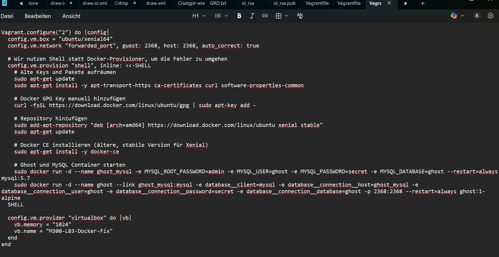
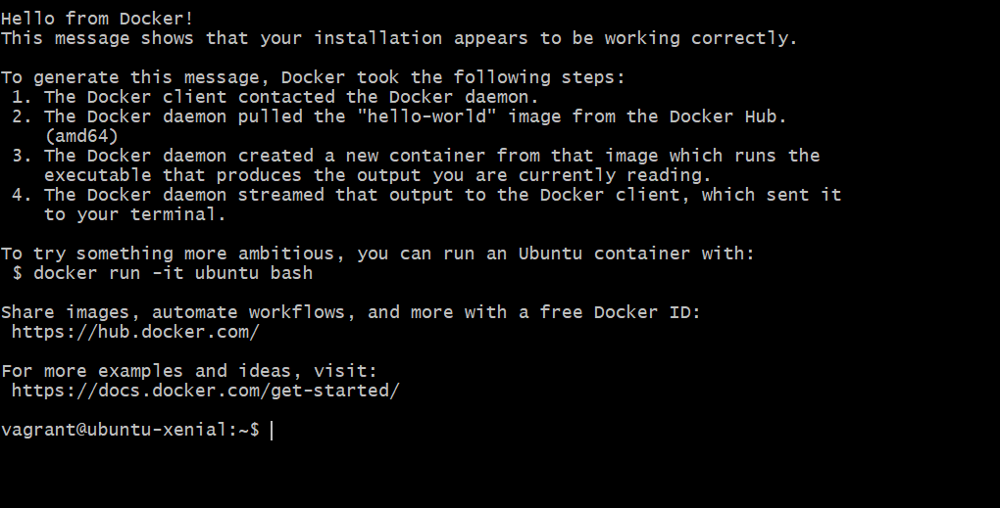
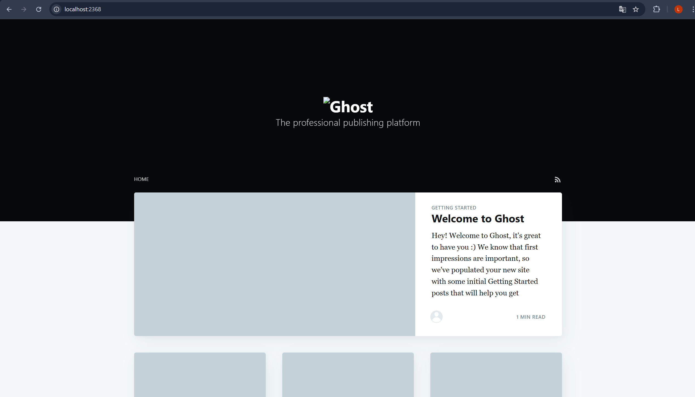

# Dokumentation LB3: Docker-Infrastruktur und Container-Automatisierung

In diesem Projekt lag der Fokus auf der Implementierung einer modernen Container-Umgebung. Anstatt Dienste direkt in einer virtuellen Maschine zu installieren, wurde Docker genutzt, um Applikationen in isolierten Containern bereitzustellen.

## 1. Installation und technisches Troubleshooting

Mein primäres Ziel war es, eine funktionale Docker-Umgebung innerhalb einer Vagrant-VM auf Basis von Ubuntu Xenial bereitzustellen. Da der Standard-Docker-Provisioner von Vagrant aufgrund veralteter GPG-Sicherheitsschlüssel in den Repositories fehlschlug, musste ich eine manuelle Lösung erarbeiten.

**Problemanalyse:**
Die automatische Installation brach ab, da das System die Echtheit der Docker-Pakete nicht verifizieren konnte. Dies liegt an den abgelaufenen Schlüsseln für die ältere Ubuntu-Version.

**Meine Lösung:**
Ich habe die Konfiguration im `Vagrantfile` angepasst und die Installation über ein Shell-Skript definiert. Dabei wurden folgende Schritte automatisiert:

> 

* Bereinigung alter Repository-Einträge.
* Manueller Import des aktuellen GPG-Schlüssels von Docker via `curl`.
* Einbindung des stabilen Repositories für Ubuntu Xenial.
* Installation der `docker-ce` Pakete über die Paketverwaltung `apt`.

## 2. Verifizierung mittels Funktionstest (Hello-World)

Nach der erfolgreichen Anpassung des Skripts liess sich die VM mit dem Befehl `vagrant up` fehlerfrei provisionieren. Um sicherzustellen, dass die Docker-Engine korrekt auf Anfragen reagiert und Container-Images aus dem Netzwerk laden kann, habe ich eine Systemprüfung durchgeführt.

Dazu habe ich mich mittels `vagrant ssh` mit der Maschine verbunden und den standardisierten Test-Container gestartet:

**Ausgeführter Befehl:**

```bash
sudo docker run hello-world

```
> 

Dieser Befehl löst den Download eines minimalen Images aus, startet den Container und gibt eine Bestätigungsmeldung aus. Da die Meldung «Hello from Docker!» erschien, war bewiesen, dass die gesamte Engine einwandfrei konfiguriert ist.

## 3. Automatisierte Container-Kombination (Ghost & MySQL)

Der Kern dieses Auftrags war die Verknüpfung von zwei unterschiedlichen Diensten zu einer Gesamtlösung. Durch die Erweiterung des Shell-Skripts im `Vagrantfile` wurden beim Systemstart automatisch zwei Container instanziiert und miteinander vernetzt:

1. **Backend-Dienst:** Ein MySQL-Datenbank-Container, der für die Speicherung der Blog-Inhalte zuständig ist.
2. **Frontend-Dienst:** Ein Ghost-Blog-Container, welcher die Benutzeroberfläche bereitstellt.

Besonders wichtig war hierbei die Verknüpfung der beiden Container (Linking). Über Umgebungsvariablen wurde dem Ghost-Container mitgeteilt, wie er die Datenbank erreicht. Zudem wurde eine Port-Weiterleitung eingerichtet, damit der Dienst von ausserhalb der VM erreichbar bleibt.

**Erfolgsprüfung:**
Ich habe die Funktionalität getestet, indem ich vom Browser meines Host-Laptops auf die Adresse zugegriffen habe.

* **URL:** `http://localhost:2368/`

> 

Die erfolgreiche Anzeige der Ghost-Startseite bestätigt, dass die Container-Vernetzung, die Datenbank-Kommunikation und das Port-Forwarding korrekt funktionieren.


