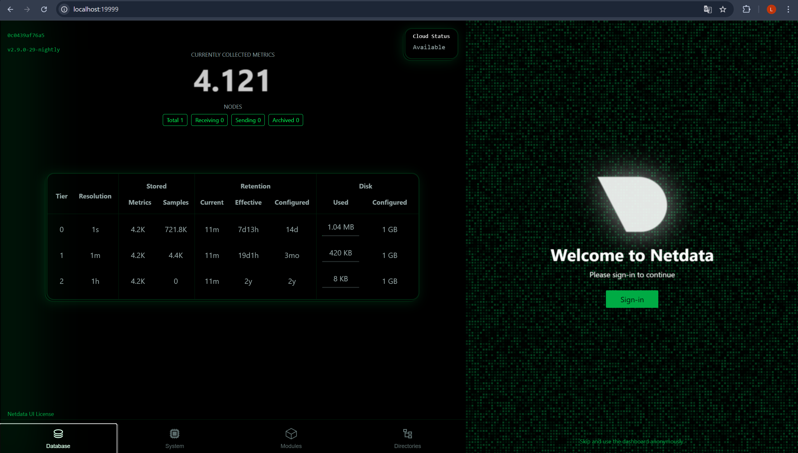
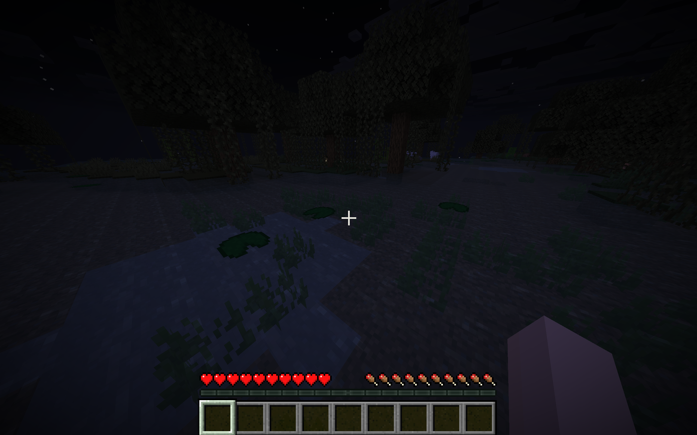
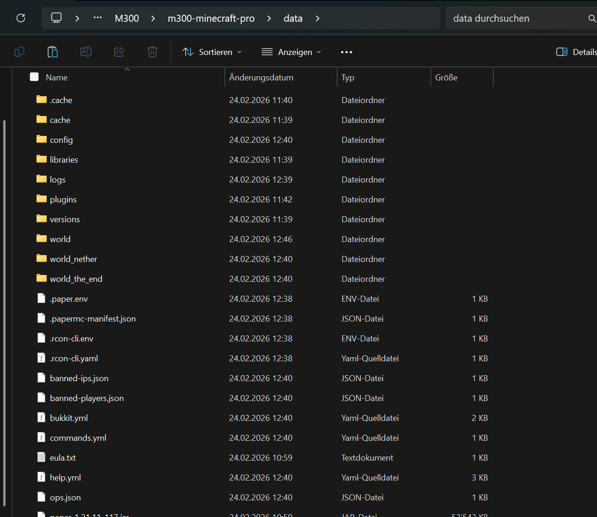
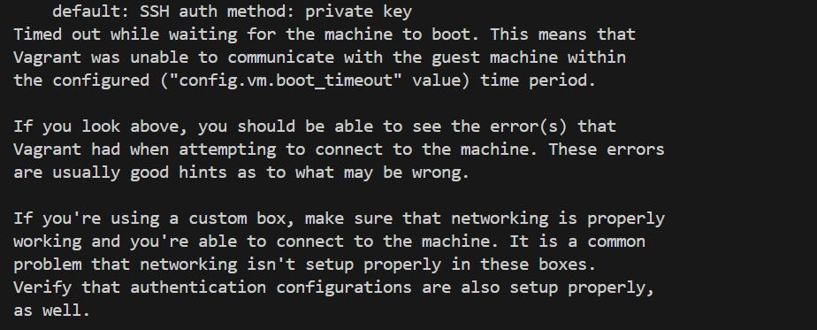

# Projektdokumentation M300: Hochverfügbare Minecraft-Infrastruktur mit automatisiertem Monitoring

## 1. Zweck des Services

Im Rahmen des Moduls M300 wurde ein Minecraft-Server auf Basis der **PaperMC-Engine** realisiert. Der Zweck dieses Projektes ist es, die Vorteile der Containerisierung (Docker) gegenüber einer nativen Installation aufzuzeigen. Durch den Einsatz von Docker wird eine isolierte Laufzeitumgebung geschaffen, die unabhängig vom Host-Betriebssystem agiert. Dies minimiert Konflikte mit Java-Versionen oder System-Bibliotheken und ermöglicht eine sekundenschnelle Skalierung.

## 2. Aufbau und logische Struktur

Die gesamte Umgebung wurde nach dem Prinzip **"Infrastructure as Code" (IaC)** entworfen. Das bedeutet, dass die gesamte Infrastruktur in Textdateien definiert ist und somit jederzeit identisch wiederhergestellt werden kann.

* **Vagrant:** Dient als Hypervisor-Abstraktionsschicht. Es erstellt eine virtuelle Maschine (Ubuntu Bionic), konfiguriert das Netzwerk und installiert automatisch Docker sowie Docker Compose.
* **Docker Compose:** Orchestriert den Multi-Container-Setup. Es verbindet den Minecraft-Dienst mit dem Monitoring-Dienst in einem gemeinsamen virtuellen Netzwerk.
* **Netdata:** Ein professioneller Monitoring-Agent, der Metriken direkt aus dem `/proc` und `/sys` Verzeichnis des Hosts sowie über den Docker-Socket ausliest.

---

## 3. Konfiguration und Monitoring

Die Konfiguration des Servers erfolgt deklarativ über Umgebungsvariablen in der `docker-compose.yml`. Dies verhindert manuelle Fehler in Konfigurationsdateien.

* **Echtzeit-Analyse:** Zur Überwachung wird **Netdata** eingesetzt. Es bietet ein hochauflösendes Web-Dashboard, das CPU-Cycles, RAM-Adressierung und I/O-Latenzen der Festplatte visualisiert.
* **Container-Status:** Mittels `docker stats` wird die Auslastung direkt auf der CLI überwacht, um die korrekte Funktion der gesetzten Ressourcen-Limits (Memory-Limit) zu verifizieren.

> 

---

## 4. Netzwerkverbindung und Ports

Um die Erreichbarkeit des Dienstes vom physischen Host (Laptop) sicherzustellen, wurde eine zweistufige Port-Weiterleitung implementiert:

1. **Vagrant-Layer:** Weiterleitung von Host-Port `25565` auf Gast-Port `25565`.
2. **Docker-Layer:** Mapping des Container-Ports auf den VM-Port.

* **Minecraft:** Port `25565` (TCP) für den Game-Traffic.
* **Monitoring:** Port `19999` (TCP) für das HTTP-basierte Dashboard.

> 

---

## 5. Host-Interaktion und Volumes

Ein kritischer Aspekt bei Docker-Containern ist ihre Kurzlebigkeit ("Ephemerality"). Ohne Gegenmassnahmen wären alle Spieldaten nach einem Container-Neustart gelöscht.

* **Persistenz-Strategie:** Über ein **Bind-Mount** wird das Verzeichnis `./data` auf dem Laptop mit `/data` im Container synchronisiert.
* **Interaktion:** Dies ermöglicht es, Plugins oder Welt-Daten direkt über das Dateisystem des Laptops zu verwalten, während der Dienst läuft.

> 

---

## 6. Fehlerdokumentation (Troubleshooting)

Die Fehlerbehebung war ein zentraler Teil des Lernprozesses. Folgende Hürden wurden dokumentiert:

1. **Vagrant-Initialisierung:** Ein Syntax-Fehler verhinderte den Start der VM ("A box must be specified"). Durch Korrektur des Ruby-Skripts im Vagrantfile wurde dies behoben.
2. **Inkompatible Compose-Versionen:** Die Version `3.8` wurde vom Standard-Paketmanager nicht unterstützt. Ein Downgrade auf `3.3` stellte die Funktionalität sicher.
3. **DNS-Auflösungsprobleme:** Der Container konnte keine Daten von `papermc.io` herunterladen. Die Lösung war die Aktivierung des `natdnshostresolver1` in den VirtualBox-Settings via Vagrant, um die DNS-Anfragen über den Host-Resolver zu leiten.
4. **Ressourcen-Timeout:** Aufgrund zu geringer RAM-Zuweisung hängte sich die VM beim Starten auf. Der Arbeitsspeicher wurde daraufhin auf 2560MB erhöht.

> 

---

## 7. Fazit

Die Umsetzung zeigt, dass moderne IT-Infrastruktur durch Abstraktion (Vagrant/Docker) extrem effizient verwaltet werden kann. Die grösste Herausforderung lag in der Netzwerkkonfiguration (DNS), was die Komplexität von virtuellen Umgebungen unterstreicht. Das Projekt ist nun vollständig dokumentiert, reproduzierbar und durch das Dashboard professionell überwacht.

